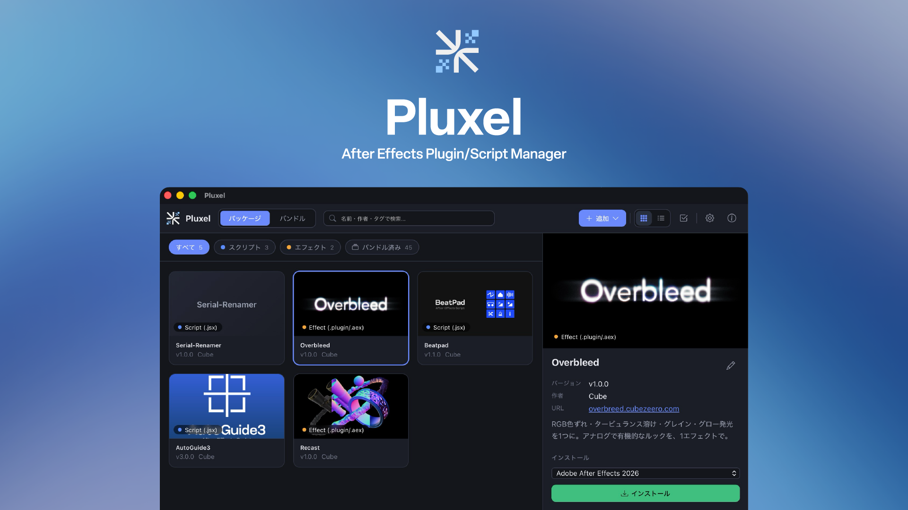

<!-- =========================================================================
     Place the HERO image here (e.g. add docs-en/assets/hero.png and replace
     the "HERO" comment below with   ).
     Image to be provided by cubezeero.
     ========================================================================= -->

<!-- HERO -->

# Pluxel

**Collect, organize, and install your After Effects scripts and plugins.**
 A library and installer — a desktop app for macOS and Windows.

[Download](https://github.com/CubeZeero/Pluxel/releases){ .md-button .md-button--primary }
[GitHub](https://github.com/CubeZeero/Pluxel){ .md-button }

---

## What Pluxel does

- **Store** — Register scripts, plugins, and extensions into your library by drag & drop
- **Auto-install** — Detects installed After Effects versions and places each item in the correct folder for its type
- **Companion files included** — Bundle `.ffx` presets and panel image folders that ship alongside a `.jsx`, and install them together
- **Update / uninstall** — Records where each item was installed, so you can reinstall (update) or remove it later
- **Batch install** — Install multiple selected items in a single action
- **Backup** — Export your entire library to a single package file (`.ppf`) and restore it anywhere

## Supported file types

| Type | Extensions | Install target |
| --- | --- | --- |
| Script | `.jsx` / `.js` / `.jsxbin` | Scripts |
| ScriptUI panel | `.jsx` / `.jsxbin` | Scripts › ScriptUI Panels |
| Effect plugin | `.plugin` / `.aex` | Plug-ins |
| CEP extension | `.zxp` | CEP Extensions |
| Installer | `.pkg` / `.exe` / `.msi` | Run (individually) |

## Next step

- [Usage](usage/index.md) — from installing to updating and creating packages
